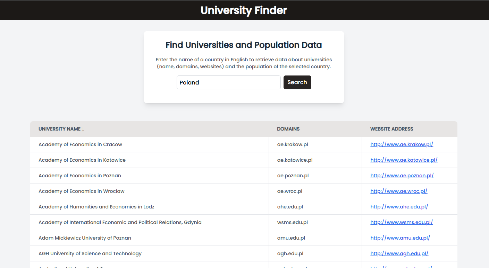

# University Finder App

This is a web application that allows users to search for universities and population data by entering the name of a country. The app integrates two APIs to provide detailed information about universities in the selected country, as well as the latest population statistics.

## Features

- Search for universities by entering the name of a country in English.
- Display university names, domains, and website links for the selected country.
- Fetch and display the latest population data for the country.
- Input validation to ensure correct country names.
- Error handling for invalid country names and network errors.

## Demo

  <!-- Add a screenshot of your app -->


## Tech Stack

- **Frontend**: React, TypeScript, Tailwind CSS
- **Build tool**: Vite
- **API Integration**: Redux Toolkit Query
- **Backend APIs**:
    - [Universities API](http://universities.hipolabs.com)
    - [CountriesNow Population API](https://countriesnow.space)

## Security of the Form

The search form in this application includes the following security measures to ensure safe and proper input handling:

1. **Input Validation**:
    - The country name input is validated to ensure it only contains letters and spaces.
    - Input must be between 3 and 30 characters long.
    - Special characters, numbers, or empty inputs are not allowed. This protects the app from improper or potentially harmful input.

2. **Prevention of Special Characters and Numbers**:
    - A regular expression is used to prevent the submission of special characters and numbers in the country name field. This ensures that only valid country names are processed.

3. **Error Handling**:
    - If the input is invalid (e.g., too short, contains special characters, or is empty), the user is shown a clear error message, and the search request is not sent until the input is corrected.

These security measures help prevent incorrect or malicious data from being submitted to the API and improve the overall reliability and safety of the application.


### Project Structure
 ```bash
├── public
├── src
│   ├── app
│   │   ├── slices        # Redux slices
|   |   └── store.tsx     # Redux store
│   ├── components
│   │   ├── Form          # Search form component
│   │   ├── Table         # Universities table component
│   │   ├── Population    # Population data display component
│   │   ├── Loader        # Loading bar component
│   │   ├── shared        # Shared components (Header, Footer)
│   └── App.tsx           # Main application component
├── README.md
├── package.json
```

## Installation

### Requirements

Ensure you have the following installed:
- [Node.js](https://nodejs.org/) (v14 or newer)
- [npm](https://www.npmjs.com/) or [yarn](https://yarnpkg.com/)

### Steps

1. **Clone the repository:**
   ```bash
   git clone https://github.com/patchker/university-finder
   cd university-finder
2. **Install dependencies:**
   ```bash
   npm install

3. **Start the development server:**
   ```bash
   npm run dev
4. **Open the app in your browser: Navigate to http://localhost:5173/ to use the application.**

### Usage
1. Enter the name of a country in English (e.g., "Germany").
2. Click "Search" or press Enter to submit the form.
3. The app will fetch and display:
- A list of universities in the country, including their domains and websites.
- The most recent population data for the country.

### Example
Searching for Germany will return a list of universities such as "Albert-Ludwigs-Universität Freiburg" along with their web pages and domain names, as well as the population of the country.
